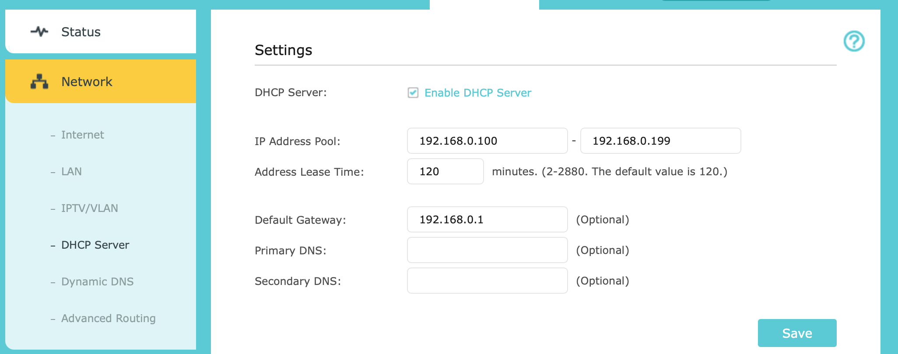

# ADR-0002: DHCP or Static IP via netplan

Data: 2026-09-14
Status: accepted

## Context

When i'm configurin my Ubuntu Server I pass for problems with the IP, because in my city sometimes the energy down, and the IP change, or if I have to restart the router, the IP changes.

To solve this problem I ask to GPT or Claude, I don't remember!

"How can I solve my problem with IP changing?".

It suggested: Can you access the /etc/netplan/*yml or access the dashboard of your router using the DHCP.

I save this idea to use when I start this project.

Importants information:

In my case I use a router in my bedroom(TP-LINK Archer C6) and it have the option Router.

The principal router is a Intelbras, and I can't access the Dashboard, because the internet provider don't give me the password to access the dashboard.

## Decision

I choose the Static IP, because my goal with this project is: A reprodutible Infrastructure, and with DHCP I can't reprodutible all the Infrastructure with Ansible

## Discarded Alternatives

DHCP, is good, but to create a reprodutible Infrastructure I "need" to choose netplan, because Ansible(Future implementation in project), **can configure a Linux machine via SSH**, and if we have the IP configurated in router, this mean that's Ansible can't configure the IP Address, diferently the netplan, that's is locate in the Machine.

## Consequences

1. This force me to understand more about Networking, and I really pretend to invest more time studying networking!

2. Now I have to register the **pool** in `docs/inventory.md`

3. For change the IP need to look the `docs/inventory.md`, because the pool can be change.

4. To change the network, I need to edit the yaml, with the monitor and keyboard with cable, because the remote access can be break.

5. To apply changes is recommend use `netplan try`, because netplan try revert the config in 120s if I don't confirm.
